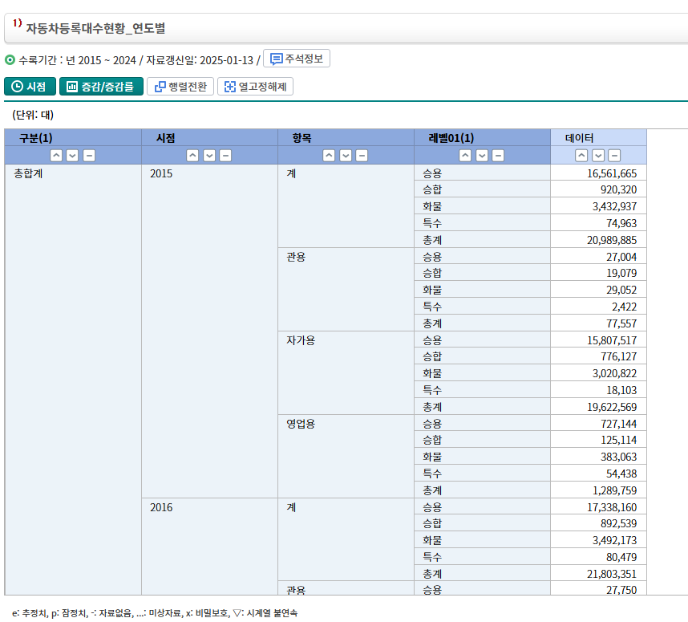
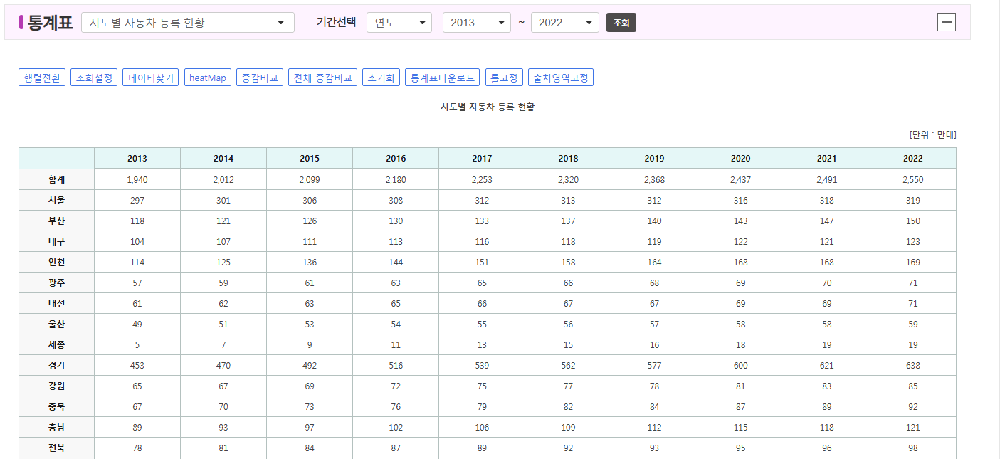
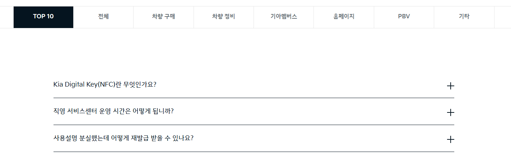

# SKN10 - 1st - 1Team
 
 
 

# 프로젝트 소개
### 프로젝트 명 : 전국 자동차 등록 현황 및 기업 FAQ 조회 시스템

### 프로젝트 소개 : 
- 국내 자동차의 연도별, 지역별 현황 페이지를 통해 증감 추이에 대한 정보를 제공하고, 지도 데이터를 통해 시각화 된 정보를 조회하는 기능을 제공합니다. 
- 기아 자동차에 대한 차량구매, 차량 정비, 기아멤버스, 홈페이지 등의 관한 질문에 대한 질문 및 답변 정보를 제공하고, 필요한 키워드로 검색할 수 있는 기능을 제공합니다.

### 프로젝트 ppt : 

   

# 팀 소개
-
<table align="center">
  <tbody>
    <tr>
      <td align="center"><b>원유형</b></td>
      <td align="center"><b>이서영</b></td>
      <td align="center"><b>조현정</b></td>
    </tr>
    <tr>
      <td align="center">
        

          
        

      </td>
      <td align="center">
        

          
        

      </td>
      <td align="center">
        
      </td>     
    </tr>
    <tr>
     <td align="center"> 팀장 </td>
     <td align="center"> 화면설계 </td>
     <td align="center"> FAQ 화면 구현</td>
    </tr>
    
  </tbody>
</table>
<table align="center">
  <tbody>
    <tr>
      <td align="center"><b>권석현</b></td>
      <td align="center"><b>정소열</b></td>
      <td align="center"><b>기한정</b></td>
    </tr>
    <tr>
      <td align="center">
        

          
        

      </td>
      <td align="center">
        

          
        

      </td>
      <td align="center">
        

          
        

      </td>
    </tr>
    <tr>
     <td align="center"> ERD,DB</td>
     <td align="center"> 등록현황 화면구현 </td>
     <td align="center"> crawling,DB </td>
    </tr>
  </tbody>
</table>
   

# 기술 스택
- 

<table>
  
  <tr>
    <td>사용한 기술</td>
    <td></td>
    <td></td>
    <td></td>
    <td></td>
    <td></td>
  </tr>  
</table>

# 수집 데이터
## 자동차등록대수현황_연도별 

- 2015~ 2024년의 연도별 차종, 용도, 차량 등록 대수를 기록한 데이터
- 원본 데이터 링크 : 
[KOSIS](https://kosis.kr/statHtml/statHtml.do?sso=ok&returnurl=https%3A%2F%2Fkosis.kr%3A443%2FstatHtml%2FstatHtml.do%3Flist_id%3DM2_18%26obj_var_id%3D%26seqNo%3D%26tblId%3DDT_MLTM_5498%26vw_cd%3DMT_ZTITLE%26orgId%3D116%26path%3D%252FstatisticsList%252FstatisticsListIndex.do%26conn_path%3DMT_ZTITLE%26itm_id%3D%26lang_mode%3Dko%26scrId%3D%26)

## 시도별자동차등록현황

- 2013~ 2022년의 연도별, 시도별, 차량 등록 대수를 기록한 데이터
  

## 크롤링 데이터: 기아 FAQ

- page 및 카테고리 별 정보를 가져오기 위해 동적 스크래핑 라이브러리인 selenium을 사용함

# ERD

- 종합관리, 차종등록현황, 지역등록현황, 지역등록현황, FAQ 테이블로 구성됨

   
# 화면 설계서
-

   

   

   

# 실제 화면
-

   

   

# 회고
-
  

원유형 : 

이서영 : 

정소열 : 

권석현 :

조현정 :

기한정 : 프로젝트에서 크롤링을 하면서 애로사항이 많았는데 그 과정에서 많은 것을 배울 수 있었습니다. 맨처음에 BeutifulSoup으로 긁어올 땐 데이터 수가 엄청 적어서 뭐가 문제지 하면서 계속 html 코드를 보고, 구조를 보면서, 알맞는 class name을 찾고 동적 크롤링으로 코드를 변경하여 모든 페이지와 카테고리의 질문들을 가져올 수 있었습니다. 끊임없이 고민하는 과정들을 통해 많이 배운것 같습니다.